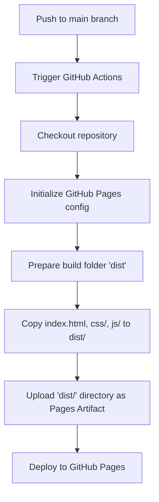

# GitHub Pages 自动部署设计文档

本文档定义了当 `main` 分支发生变化时，通过 GitHub Actions 自动构建并部署项目到 GitHub Pages 的方案。

## 目标与背景

由于该项目（正方体折叠与展开教学软件）是一个纯静态的 Web 项目，没有复杂的打包构建过程，所有前端资源直接存放在根目录下。
为了保证最终部署到 GitHub Pages 的站点整洁、安全，我们将使用精简部署方案：仅复制前端所需的静态文件，排除非必要的测试文件和本地服务器脚本。

## 部署流程设计



## 详细设计方案

### 1. 触发时机
* 触发分支：`main`
* 触发事件：`push` 或者是手动触发 (`workflow_dispatch`)

### 2. 权限声明 (Permissions)
GitHub Pages 部署需要以下权限：
```yaml
permissions:
  contents: read
  pages: write
  id-token: write
```

### 3. 环境配置 (Environment)
* 部署的目标环境设定为 `github-pages`。
* 保证同一时间只有一个部署任务在运行，开启并发限制：
```yaml
concurrency:
  group: "pages"
  cancel-in-progress: false
```

### 4. 步骤设计 (Job Steps)
在单一的 `deploy` 任务（运行在 `ubuntu-latest` 上）中执行以下步骤：
1. **Checkout**: 使用 `actions/checkout@v4`。
2. **Setup Pages**: 使用 `actions/configure-pages@v5` 初始化 Pages 环境。
3. **Assemble Artifact**:
   * 创建临时的 `dist` 目录。
   * 复制前端文件：
     * `index.html` -> `dist/`
     * `css/` -> `dist/css/`
     * `js/` -> `dist/js/`
4. **Upload Artifact**: 使用 `actions/upload-pages-artifact@v3` 上传 `dist` 目录。
5. **Deploy**: 使用 `actions/deploy-pages@v4` 执行部署。

## 验证计划

1. **工作流有效性验证**：
   * 将工作流定义文件写入 `.github/workflows/deploy.yml`。
   * 本地执行 `git status` / `git diff` 确认内容。
2. **提交与推送**：
   * 提交并推送到 GitHub 远程仓库，观察 Actions 页面中工作流是否自动触发并运行成功。
3. **网页在线可达性验证**：
   * 访问 GitHub Pages 的发布 URL，测试页面交互与 3D 渲染功能。
